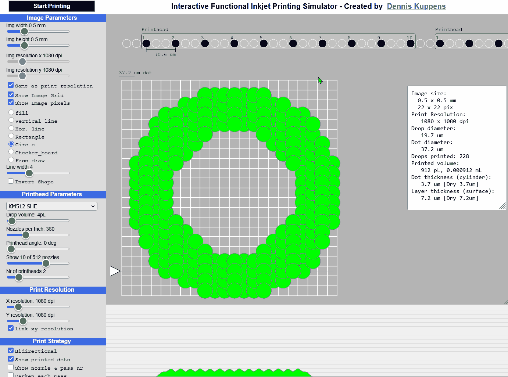

# Interactive Functional Inkjet Printing Simulator 💧💧💧
This is an inkjet printing simulator which runs in locally in modern web browsers and can be used as an educational tool to see the effect of the most important parameters involved in functional and graphical inkjet printing. 

{width=600} 

# Try it now
<a href="https://denkuppens.github.io/InteractivePrintingSimulator" target="_blank">Click here to open the printing simulator.</a> (hold ctrl while clicking to open in a new tab)

# Offline installation
Download the source from the repository by clicking this [link](https://github.com/denkuppens/InteractivePrintingSimulator/archive/refs/heads/master.zip), then unpack the zip file and open the file: <code>PrintSimulator.html</code> in your web browser.

## Application Features
### Main features
- Visually simulating inkjet printing of an image with just one click
- Auto generation of the image or free drawing the image with the mouse
- Information window showing, image size, print resolution, drop diameter, dot diameter, dot, layer thickness, volume of ink printed, number of drops printed
- Cross section showing an approximation of the printed surface thickness and roughness
- Changing parameters while animating has direct effect
- Enabling and disabling nozzles shows the impact on the printing result
- Settings for many piezo printheads are included

### Image parameters
- Independent image width and height
- Independent image x and y resolution
- Lock image resolution to print resolution
- Show/hide image grid
- Show/hide image pixels
- Generate patterns automatically (Fill, vertical line, horizontal line, rectangle, circle, checker board)
- free draw with the mouse, add or remove pixels (hold down Ctrl button to remove pixels)
- Dynamic line width
- Invert shape
- Import and Export images (experimental)

### Printhead parameters
- Database of Piezo printheads selectable from a drop down menu
- Variable drop volume 
- Variable nozzles per inch - NPI
- Printhead angle allowing to virtually increase the NPI
- Select how many nozzles to show per printhead (limited number to fit visually in the simulator window)
- Select the number of printheads to show
- Disable/enable nozzles by clicking on a nozzle

### Print resolution
- Independent x and y print resolution

### Print strategy
Print strategy is a complex topic but basically it defines how a printhead moves over the substrate and when, which nozzle jets a droplet for a certain pixel position. The simulator implements a fixed number of strategies but certainly not all because print strategy development is a huge research topic in itself. 
- Uni- or bi-directional printing
- Show/hide the printed dots
- Show the nozzle number and print pass number
- Darken dots per print pass (sometimes called print swath) to see what dots are printed in each pass
- Show/hide dots up to a certain print pass
- Quality factor, mixing nozzles to create redundancy to reduce impact of blocked nozzles and to allow to compensate by other nozzles
- Enable/disable auto compensation of blocked nozzles 

### Ink parameters
- Color of the printed dots
- Solid content percentage of the ink vs percentage of solvents which evaporate once printed

### Ink-Substrate interaction
- Wetting dot gain determines the amount a drop flows out when touching the substrate. This depends on the amount of ink surface-tension, substrate surface-energy or substrate ink absorption. It can be determined by printing an actual drop on a surface and then measure the amount a drop spreads. In practice pre-treatment is mostly done by chemical or a plasma treatment.
- Planarization or smoothing is the amount the ink flows into itself. In practice this is done by giving the ink more time to flow.

### Other features
- Loop the animation, useful for untended demonstration purposes
- Drop jet animation, showing how a droplet deforms when falling onto a substrate. This animation is not parameterized and is only intended to show the concept. 
- Save current settings (experimental)
- Load last saved settings (experimental)
- Open small bitmap images 

## Why is the simulator specifically for functional Inkjet?
There is a difference between graphical inkjet printing and functional inkjet printing. Graphical printing is printing an image for a person to see. Think about paper leaflets, flags, banners, ceramic tiles, coffee mugs etc. 
Functional printing is printing a functional material which performs a function like: conducting, electrically isolating, blocking light, light emitting, structural (3d printing), medication, bio-medical materials, and many more. Functional inkjet is sometimes more critical for the printing process than graphical. For example, if a droplet of ink is missing in a poster then that wouldn't even be noticed by a person. If you print a conductive trace and one or more droplets are missing, that trace might not be conductive anymore. And also the thickness of that line effects the conductivity of the track. Hence the simulator also shows the thickness and surface roughness of the printed ink. This is what makes this simulator unique. 

If you like to learn more about functional inkjet printing or inkjet printing in general you can watch this recording of a webinar where I present 'the Basics of functional inkjet printing'

### Not implemented features
Because the simulator is targeted at functional inkjet printing, some commonly known printing concepts from the graphical industry are not (very) applicable and therefore not implemented.
- Non-piezo based printheads are not included in the database. This is because functional printing primarily uses piezo based printheads. These heads compatible with a much wider range of functional inks compared to thermal based printheads, sometimes called bubble jet, or other types of inkjet technologies. However any printhead can be simulated by setting the drop size and NPI in the simulator manually.
- Gray scale support. Gray scale is a feature of certain printheads to jet different drop sizes for each pixel location. This works by quickly jetting multiple drops of the native smallest droplet which then merges in-flight to form a larger droplet before hitting the surface of the substrate. The simulator supports only one drop size and only binary images with black and white pixels. Gray-scale is a mainly used for graphical- and roll-to-roll single pass printing. In functional, multi-pass printing a similar effect can be achieved by printing another droplet on the same spot in another pass or layer. In the past 10+ years, I've not came across a single use case for gray scale in the functional printing industry where gray scale was a must have. Even throughput is not a valid argument because printing gray scale reduces the maximum jetting frequency by about half for each gray-scale.
- Multi layer printing. Printing on top of an another layer is supported by many printers but not supported in the simulator as this is an easy concept to understand.
- Multi color or multi ink is not supported. Most industrial printheads support only one ink and in the functional printing industry the ink color is not the main requirement. There are niche use cases where multiple inks are needed and in those cases multiple heads are used or multi ink channel printheads. Because these are rather niche and rare it is not implemented.
- Redundant printheads. Redundant printheads is another way, next to the quality factor, to create redundancy to compensate for blocked nozzles. This is not implemented as it is an easy concept to understand. 
- A few know bugs:
	- Nozzle compensation does not take neighboring printheads into account
	- Tooltips are missing for most controls

## Current status
The simulator is functional and turned out to work very well as an educational tool. This was the initial goal of the project so in that sense the project is complete and successful.
While the functionality- and feature set is fairly decent, the quality of the source code in terms of OOP design and maintainability is something I'm not particularly proud of to be honest. I created the simulator in limited private spare time in between other things while learning JavaScript, HTML, CSS and [PS5.js](https://p5js.org/). Considering this being a private side-project I think that's fine.

## The future
Unfortunately I am not planning to continue to work on this tool. I just don't have time in my schedule to work on it. By making it open source I hope the community has interest to bring the tool to the next level. My dream would be that this tool turns into a complete- and accurate fluid-dynamics simulator, missing features are added while keeping it as user friendly and interactive as is it now.

## Why did I create this?
I'm working in the inkjet industry for a long time and I had to explain many times how inkjet works. However, inkjet is a complex technology and it is difficult to explain just by words. This gave me the idea to create a tool to simply show the effect of a certain parameter. Before it took me an hour to explain a certain concept and still people were confused. With this tool most people understand it in minutes.

## Who am I and why am I making this tool available?
As said, I've been working most of my long career in the inkjet printing industry. Started as an engineer, became system architect, development manager, product manager of inkjet printers and now I am in a strategic product manager role for a portfolio of coating machines and not only inkjet anymore. Because of this I am less technically involved in inkjet projects but because I love to share my expertise and have a warm hart for the inkjet ecosystem, I've decided to make this simulator open source and share it with the community.

## Conctact
[Via linkedIn](https://www.linkedin.com/in/dennis-kuppens-5753a92/)

## Thanks to
- ImageXpert who maintains [The Ultimate Industrial Inkjet Printhead Comparison Chart](https://imagexpert.com/the-ultimate-industrial-inkjet-printhead-comparison-chart/) which I used for the simulator printhead database. Thanks Kay Bell for sharing this with us 👍
- [The Coding Train youtube channel](https://www.youtube.com/channel/UCvjgXvBlbQiydffZU7m1_aw) for the P5.js tutorials

## License
AGPL-3.0
